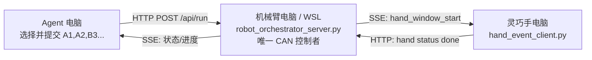

# Panthera + Linker 三机局域网联调包

## 当前已经完成

- 机械臂控制电脑运行在 Windows + WSL Ubuntu 22.04；Panthera 从臂通过 USBIP/`/dev/ttyACM*` 接入 WSL，并使用 Conda 环境 `panthera`。
- 从臂使用 `Follower.yaml`，实际控制的是 6 个机械臂关节。外接 Linker 灵巧手不由 Panthera 脚本控制。
- `scripts/A_replay_trajectory.py` 已实现：Gra+Fri 示教、空格记录/锁定、点位 JSON 保存、七次平滑插值回放、每点停留、结束回 Reset 零位。
- 点位可以作为库复用：同一 JSON 可重复引用，也可组合多个 JSON，例如 `A1,A2,B3,A4,B5`。
- 本目录新增三机协调服务：Agent 电脑只负责编排点位；机械臂电脑是唯一硬件控制者；灵巧手电脑接收每个手部窗口事件并回传完成状态。

## 三机职责



机械臂电脑只运行协调服务器，不能同时运行 `./backend.sh --live`、`A_replay_trajectory.py`、`5_record_trajectory.py` 或其他直接访问 CAN 的脚本。

## 文件清单

- `robot_orchestrator_server.py`：在机械臂电脑 WSL 中运行的协调服务器。
- `orchestrator_config.example.json`：点位库和端口配置模板。
- `agent_client.py`：发给 Agent 电脑的无第三方依赖命令行客户端。
- `hand_event_client.py`：发给灵巧手电脑的 SSE 客户端模板；真实 Linker SDK 调用应接入 `run_linker_hand_action()`。
- `windows/setup_windows_portproxy.ps1`：WSL NAT 模式下，使局域网内其他电脑访问 Windows 主机端口的管理员脚本。

## 压缩包使用方式

压缩包内保留 `panthera_python` 下的相对目录结构：`lan_orchestrator/` 和 `scripts/A_replay_trajectory.py`。

- 机械臂电脑：解压到现有的 `~/Panthera-HT_Host/panthera_python/`，使 `lan_orchestrator/` 与 `scripts/` 合并到该目录。
- Agent 电脑：只需复制 `lan_orchestrator/agent_client.py`。
- 灵巧手电脑：只需复制 `lan_orchestrator/hand_event_client.py`，以及本说明文件供联调参考。

## 1. 机械臂电脑部署

在 WSL 中执行：

```bash
conda activate panthera
cd ~/Panthera-HT_Host/panthera_python/lan_orchestrator
cp orchestrator_config.example.json orchestrator_config.json
```

编辑 `orchestrator_config.json`：

- `api_token` 改为团队共享但不公开的随机口令。
- `trajectory_files` 按顺序填写实际录制的 JSON。第一个文件自动是 `A`，第二个是 `B`，第三个是 `C`。
- 每个 JSON 文件必须保留在机械臂电脑的 WSL 文件系统中。

示例：

```json
{
  "server": {"host": "0.0.0.0", "port": 5100, "api_token": "TEAM_SECRET"},
  "robot_config": "../robot_param/Follower.yaml",
  "trajectory_files": [
    "../scripts/waypoints_20260711_101058.json",
    "../scripts/waypoints_20260711_111628.json"
  ]
}
```

确认 USBIP 已 attach、`/dev/ttyACM0` 至 `/dev/ttyACM6` 存在后，启动服务器：

```bash
python robot_orchestrator_server.py
```

## 2. 开放 Windows 到局域网的入口

由于当前 WSL 使用 NAT，局域网其他电脑应访问 **Windows 的局域网 IP**，而不是 WSL IP。

在机械臂电脑的“管理员 PowerShell”中运行一次：

```powershell
cd \\wsl.localhost\Ubuntu-22.04\home\pxy\Panthera-HT_Host\panthera_python\lan_orchestrator\windows
.\setup_windows_portproxy.ps1
```

脚本会打印 Windows 的 LAN IP，例如 `192.168.1.20`。Agent 与灵巧手电脑统一使用：

```text
http://192.168.1.20:5100
```

WSL 重启或 `wsl --shutdown` 后 IP 可能变化；此时重新运行该 PowerShell 脚本。

## 3. Agent 电脑命令

将 `agent_client.py` 复制到 Agent 电脑。该客户端只依赖标准 Python 3。

```bash
# 查看当前可用的 A/B/C 点位库
python agent_client.py --server http://192.168.1.20:5100 --token TEAM_SECRET library

# 健康检查和运行状态
python agent_client.py --server http://192.168.1.20:5100 --token TEAM_SECRET health
python agent_client.py --server http://192.168.1.20:5100 --token TEAM_SECRET status

# 编排并运行：A/B 可交叉、可重复
python agent_client.py --server http://192.168.1.20:5100 --token TEAM_SECRET run \
  --sequence "A1,A2,B3,A4,B5" --hold-time 5

# 紧急请求停止：服务器保持实际当前位置，不会追赶旧目标
python agent_client.py --server http://192.168.1.20:5100 --token TEAM_SECRET stop
```

需要等待灵巧手显式完成时：

```bash
python agent_client.py --server http://192.168.1.20:5100 --token TEAM_SECRET run \
  --sequence "A1,B2,A3" --hold-time 5 --wait-for-hand-done --hand-timeout 30
```

此模式每个点至少停留 5 秒；随后最多再等待 30 秒，直到灵巧手客户端回传 `done`。超时会安全中止而不是盲目前往下一点。

## 4. 灵巧手电脑联调

将 `hand_event_client.py` 复制到灵巧手电脑。

先做网络联调，不发送真实手部电机命令：

```bash
python hand_event_client.py --server http://192.168.1.20:5100 --token TEAM_SECRET --auto-done
```

它会显示 `hand_window_start`、手部窗口倒计时及轨迹结束事件。真实接入时，在 `run_linker_hand_action(event)` 中调用 Linker SDK；函数在动作完成后返回 `True`，客户端就会自动向服务器回传 `done`。

## 5. API 速览

| 方法 | 路径 | 调用方 | 作用 |
| --- | --- | --- | --- |
| `GET` | `/api/health` | 任意电脑 | 连通性检查 |
| `GET` | `/api/library` | Agent | 读取 A/B/C 文件与点位 |
| `GET` | `/api/status` | Agent/监控 | 当前阶段、当前点、灵巧手状态 |
| `POST` | `/api/run` | Agent | 提交 `sequence`、停留时间和等待策略 |
| `POST` | `/api/stop` | Agent | 请求安全停止 |
| `GET` | `/api/events` | 灵巧手/监控 | SSE 实时事件流 |
| `POST` | `/api/hand/status` | 灵巧手 | 回传 `ready` 或 `done` |

`POST /api/run` 的最小 JSON：

```json
{"sequence": "A1,A2,B3,A4,B5", "hold_time": 5, "pause_mode": "hold"}
```

## 安全边界

- `hold` 是默认暂停模式：机械臂保持点位，最适合精准操作灵巧手。
- `gravity-friction` 可作为 `pause_mode` 使用，但手部窗口中若机械臂漂移超过 `0.12 rad`，服务器会中止，避免下一段发生追赶跳动。
- 所有相邻点（包括跨 JSON 的 A→B）均使用七次平滑插值，并自动按关节速度限幅延长运动时间。
- 一个时刻只允许一个运行任务；其他 `run` 请求会被拒绝。
- `api_token` 为空时 API 不鉴权，只应在受信任的隔离网络中临时使用。
- 物理急停仍是最高优先级；网络 `stop` 仅是软件安全停止。

## 推荐首次联调顺序

1. 机械臂先保持断电或留出完整安全空间，启动协调服务器。
2. Agent 电脑运行 `health` 和 `library`，确认能读到 A/B 点库。
3. 灵巧手电脑运行 `hand_event_client.py --auto-done`。
4. Agent 先只执行一个低风险点，例如 `A1`，并设 `--hold-time 2`。
5. 再测试 `A1,B1,A1` 的跨文件平滑移动。
6. 最后才在 `run_linker_hand_action()` 接入真实 Linker 控制，并使用 `--wait-for-hand-done`。
